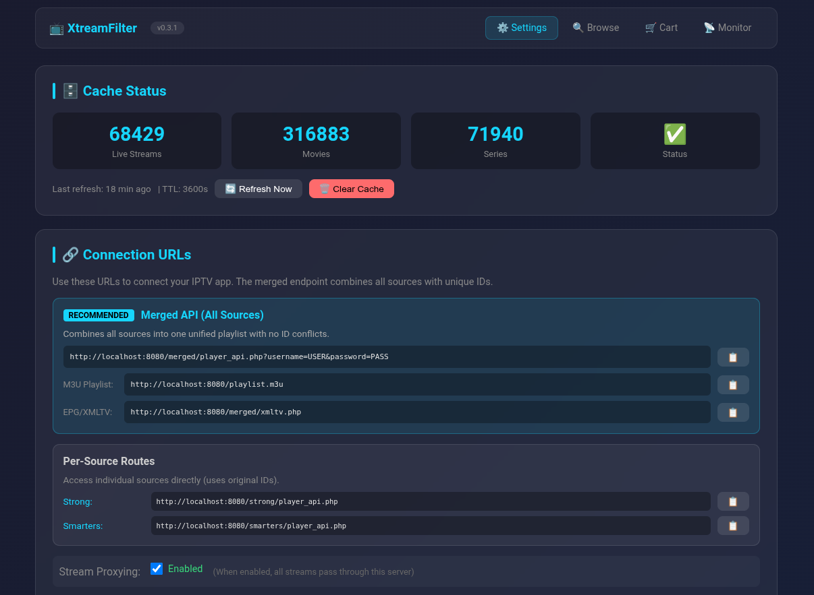
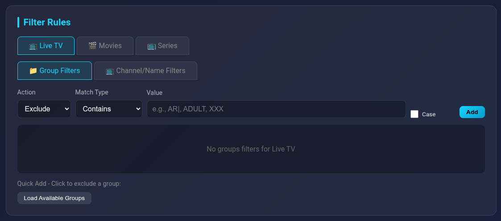

# XtreamFilter

[](https://hub.docker.com/r/spanishst/xtreamfilter)
[](https://hub.docker.com/r/spanishst/xtreamfilter)

A Docker-based Xtream Codes proxy that filters IPTV content (Live TV, Movies, Series) from multiple sources with per-source dedicated routes, merged playlists, stream proxying, and advanced filtering.

## Screenshots





## Features

- 📺 **Full Xtream Codes API Proxy** - Works with any Xtream-compatible player (TiviMate, XCIPTV, etc.)
- 🔗 **Multi-Source Support** - Configure multiple Xtream providers with dedicated routes per source
- 🎬 **Merged Playlist** - Combine all sources into a single unified endpoint with virtual IDs
- 🛡️ **Stream Proxy** - Optionally proxy all streams through the server (hides upstream URLs, better for 4K)
- 🛣️ **Per-Source Routing** - Each source has its own URL path to avoid ID conflicts
- 🎬 **Live TV, Movies & Series** - Filter all content types independently
- 🔧 **Web-based Configuration** - Easy UI to manage sources, settings and filters
- 🎯 **Advanced Filtering** - Include/exclude filters with multiple match types per source
- 🚫 **Exclude All** - Start with empty and whitelist only what you want
- 🏷️ **Source Prefixing** - Optionally prefix group names to identify content origin
- 🔄 **Smart Caching** - Background refresh with configurable TTL and real-time progress bar
- 💾 **Persistent Cache** - Survives container restarts
- � **Content Browser** - Browse and search all your content with cover art and details
- 📂 **Custom Categories** - Create manual or automatic categories with pattern matching
- 📱 **Telegram Notifications** - Get notified when new content matches your categories
- ⬇️ **VOD & Series Downloads** - Download movies and series episodes locally with a cart-based queue
- 📡 **Series Monitoring** - Automatically track series for new episodes with auto-download and Telegram alerts
- �🐳 **Docker Ready** - Easy deployment with docker-compose

## Quick Start

### Using Docker Hub (Recommended)

```bash
docker run -d \
  --name xtreamfilter \
  -p 8080:5000 \
  -v ./data:/data \
  --restart unless-stopped \
  spanishst/xtreamfilter:latest
```

Or with docker-compose, create a `docker-compose.yml`:

```yaml
services:
  xtreamfilter:
    image: spanishst/xtreamfilter:latest
    container_name: xtreamfilter
    ports:
      - "8080:5000"
    volumes:
      - ./data:/data
      - ./downloads:/data/downloads
    restart: unless-stopped
    environment:
      - TZ=Europe/Paris
```

Then run:

```bash
docker-compose up -d
```

### Building from Source

1. **Clone the repository:**

```bash
git clone https://github.com/spanishst/xtreamfilter.git
cd xtreamfilter
```

2. **Build and run:**

```bash
docker-compose up --build -d
```

### Next Steps

1. **Open the web UI:**

```
http://localhost:8080
```

2. **Add your Xtream source(s)** in the Sources section:
   - Name, Host, Username, Password
   - **Dedicated Route** (required): URL path for this source (e.g., `myprovider`)

3. **Configure your filters** for each source - Live TV, VOD, and Series

4. **Connect your IPTV player** using one of the connection URLs shown in the UI

## Connection URLs

XtreamFilter provides multiple ways to connect your IPTV player:

### Merged Endpoint (Recommended for Multi-Source)

Combines all sources into a single playlist with virtual IDs that prevent conflicts:

```
Server: http://YOUR_SERVER_IP:8080/merged
Username: proxy
Password: proxy
```

- All sources appear in one unified playlist
- Virtual IDs ensure no conflicts between sources (each source gets a 10M ID range)
- Filters from each source are applied

### Per-Source Endpoints

Each source has its own dedicated endpoint:

**Filtered endpoint (with your filter rules applied):**
```
Server: http://YOUR_SERVER_IP:8080/<route>
Username: (from your provider)
Password: (from your provider)
```

**Unfiltered endpoint (full catalog from this source):**
```
Server: http://YOUR_SERVER_IP:8080/<route>/full
Username: (from your provider)
Password: (from your provider)
```

### M3U Playlists

Generate M3U playlists for players that don't support Xtream API:

| URL | Description |
|-----|-------------|
| `/playlist.m3u` | All sources combined (merged with virtual IDs) |
| `/<route>/playlist.m3u` | Single source filtered |
| `/<route>/full/playlist.m3u` | Single source unfiltered |

## Stream Proxy Mode

When enabled, all streams are proxied through the XtreamFilter server instead of redirecting clients directly to upstream servers.

### Benefits

- **Privacy**: Upstream server URLs are hidden from clients
- **4K Performance**: Adaptive buffering optimized for 4K streams (up to 25 Mbps)
- **Freeze Prevention**: Smart pre-buffering and dynamic buffer sizing
- **Single Point of Control**: All traffic flows through your server

### Adaptive Buffering System

The proxy includes an intelligent buffering system designed to prevent freezes when upstream servers have issues:

| Feature | Value | Description |
|---------|-------|-------------|
| **Pre-buffer** | 4 MB | Initial buffer filled before streaming starts (~1.3s at 25 Mbps) |
| **Min buffer** | 1 MB | Minimum adaptive buffer size |
| **Max buffer** | 16 MB | Maximum buffer (~5s runway at 25 Mbps for 4K) |
| **Chunk size** | 512 KB | Read chunk size for efficient memory usage |

**How it works:**

1. **Pre-buffering**: Before sending any data to the client, the proxy fills a 4 MB buffer to ensure smooth playback start
2. **Throughput monitoring**: Measures upstream speed every 2 seconds, keeping 10 samples for stability
3. **Slowdown detection**: If current throughput drops below 60% of average:
   - Buffer doubles (e.g., 1 MB → 2 MB)
   - On consecutive slowdowns, buffer increases 4x for faster response
4. **Stable recovery**: After 4 stable periods (~20s), buffer reduces by 25% to optimize memory
5. **Logging**: All buffer adjustments are logged at INFO level for monitoring

**Example log output:**
```
Pre-buffer filled: 4096.0KB in 0.34s (11993.5 KB/s)
Upstream slowdown detected (2285 KB/s < 11950 KB/s avg), increasing buffer: 1024KB -> 2048KB
Upstream slowdown detected (1781 KB/s < 7832 KB/s avg), increasing buffer: 2048KB -> 8192KB
Upstream stable (2033 KB/s), reducing buffer: 16384KB -> 12288KB
```

### Toggle

Enable/disable via the web UI in the **Connection URLs** card, or via API:

```bash
# Enable proxy
curl -X POST http://localhost:8080/api/proxy/enable

# Disable proxy  
curl -X POST http://localhost:8080/api/proxy/disable

# Check status
curl http://localhost:8080/api/proxy/status
```

When **disabled**, clients receive a 302 redirect to the upstream URL.

## Multi-Source Support

### Adding Sources

1. Open the web UI and go to the **Sources** section
2. Click **Add Source** to add a new provider
3. Enter the source details:
   - **Name**: Friendly name for the source (e.g., "Provider A")
   - **Host**: The Xtream server URL (e.g., `http://provider.example.com`)
   - **Username/Password**: Your credentials for this provider
   - **Prefix** (optional): Text to prepend to group names (e.g., `[ProvA] `)
   - **Dedicated Route** (required): URL path for this source (e.g., `providera`)
   - **Enabled**: Toggle to enable/disable this source

### Dedicated Source Routes

Each source **must have** a dedicated route. This ensures:
- No ID conflicts between providers (two sources may have series with the same ID)
- Clean separation of content per source
- Correct playback for all content types

**Example with two sources:**
- Source "Smarters" with route `smarters`:
  - Filtered: `http://YOUR_SERVER_IP:8080/smarters`
  - Unfiltered: `http://YOUR_SERVER_IP:8080/smarters/full`
- Source "Strong" with route `strong`:
  - Filtered: `http://YOUR_SERVER_IP:8080/strong`
  - Unfiltered: `http://YOUR_SERVER_IP:8080/strong/full`

### Source Prefixing

The **Prefix** option prepends text to all group names from a source, helping identify content origin when viewing in your player.

**Example:**
- Source with prefix `[US] ` → Groups become `[US] Sports`, `[US] Movies`, etc.

### Per-Source Filtering

Each source has its own independent filter configuration:
- Filters are applied per-source
- You can have different include/exclude rules per provider
- Select a source in the filter dropdown to edit its specific filters

## Filter System

### Content Categories
- **Live TV** - Television channels
- **VOD** - Movies/Films
- **Series** - TV series

### Filter Types
- **Include** - Only keep matching items (whitelist mode)
- **Exclude** - Remove matching items (blacklist mode)

### Match Modes
| Mode | Description | Example |
|------|-------------|---------|
| `starts_with` | Matches if name starts with value | `FR\|` matches "FR\| TF1" but NOT "ABC FR\| News" |
| `ends_with` | Matches if name ends with value | `HD` matches "Canal+ HD" |
| `contains` | Matches if name contains value anywhere | `Sports` matches "beIN Sports 1" |
| `not_contains` | Matches if name does NOT contain value | `XXX` excludes adult content |
| `exact` | Exact match only (case insensitive by default) | `TF1` matches only "TF1" |
| `regex` | Regular expression pattern | `^FR\|.*` for regex patterns |
| `all` | Matches everything | Use with "Exclude All" to start fresh |

### Exclude All Feature

The **Exclude All** option lets you start with a clean slate by excluding everything, then adding include rules to whitelist specific content:

1. Click "Exclude All Groups" or "Exclude All Channels"
2. Add "Include" filters for the specific content you want to keep

This is useful when you only want a small subset of content from a large catalog.

### Filter Examples

**Include only French content (Live TV):**
- Type: `include`, Match: `starts_with`, Value: `FR|`

**Exclude adult content (all categories):**
- Type: `exclude`, Match: `contains`, Value: `XXX`

**Include specific streaming services:**
- Type: `include`, Match: `exact`, Value: `NETFLIX SERIES`
- Type: `include`, Match: `exact`, Value: `DISNEY+ MOVIES`

**Start fresh and whitelist:**
1. Add: Type: `exclude`, Match: `all`, Value: `*`
2. Add: Type: `include`, Match: `starts_with`, Value: `FR|`

## Cache System

The proxy caches all data from upstream servers for fast responses:

- **Default TTL:** 1 hour (3600 seconds)
- **Background Refresh:** Automatic refresh before cache expires
- **Real-time Progress:** Visual progress bar with step-by-step updates
- **Cross-Worker Sync:** Progress is visible even when page is reloaded
- **Disk Persistence:** Cache survives container restarts
- **Per-Source Caching:** Each source is cached independently
- **Cancel Button:** Abort stuck refreshes if needed

### Cache Status

The web UI shows:
- Total Live Streams, Movies, and Series counts
- Cache validity status (✅ valid, ⚠️ expired, 🔄 refreshing)
- Last refresh time
- Progress bar during refresh with current step and source

## Browse Content

The **Browse** feature provides a rich interface to explore all your IPTV content:

- **Visual Grid View** - Browse movies and series with cover art thumbnails
- **Search & Filter** - Search by name, filter by group/category
- **Content Details** - View descriptions, ratings, cast, and episode lists
- **Quick Actions** - Add items to custom categories directly from the browser
- **Pagination** - Efficiently browse large catalogs

Access the browser at `/browse` or click the **🔍 Browse Content** button on the main page.

## Custom Categories

Create your own categories to organize content across all sources:

### Manual Categories

Manually curate collections by adding items one by one:

1. Create a category with mode **Manual**
2. Browse content and click the ➕ button to add items
3. Items remain in the category until you remove them

### Automatic Categories

Automatically collect content based on search patterns:

1. Create a category with mode **Automatic**
2. Define search patterns (contains, starts with, regex, etc.)
3. Choose pattern logic: **Match ANY** (OR) or **Match ALL** (AND)
4. Optionally filter by **Recently Added** (last 7, 14, 30 days, etc.)
5. Enable **Apply source filter rules** to respect your source filters

**Pattern Match Types:**
| Type | Description | Example |
|------|-------------|---------|
| `contains` | Name contains value | `Marvel` matches "Marvel Avengers" |
| `starts_with` | Name starts with value | `Star Wars` matches "Star Wars: Episode IV" |
| `ends_with` | Name ends with value | `4K` matches "Avatar 4K" |
| `exact` | Exact match | `Inception` matches only "Inception" |
| `regex` | Regular expression | `^The.*\(2024\)$` for regex patterns |
| `not_contains` | Name does NOT contain | `XXX` excludes adult content |

**Example:** Create a "New 4K Movies" category:
- Mode: Automatic
- Content Types: VOD only
- Pattern: `contains` → `4K`
- Recently Added: Last 7 days
- Notify Telegram: ✅

Automatic categories refresh when the cache refreshes, detecting new content automatically.

## Telegram Notifications

Get notified on Telegram when automatic categories find new content:

### Setup

1. **Create a Telegram Bot:**
   - Message [@BotFather](https://t.me/BotFather) on Telegram
   - Send `/newbot` and follow the prompts
   - Copy the **Bot Token** (e.g., `123456789:ABCdefGHI...`)

2. **Get your Chat ID:**
   - Message [@userinfobot](https://t.me/userinfobot) on Telegram
   - It will reply with your **Chat ID** (e.g., `1234567890`)
   - For groups/channels, add the bot and get the group ID

3. **Configure in XtreamFilter:**
   - Go to the main page and click **⚙️ Configure** next to "Telegram Notifications"
   - Enter your Bot Token and Chat ID
   - Enable notifications and click **💾 Save**
   - Click **🔔 Test** to verify it works

4. **Enable per category:**
   - Edit an automatic category
   - Check **📱 Send Telegram notification when new items are found**

### Notification Formats

| Scenario | Format |
|----------|--------|
| Single item with cover | Photo message with movie poster |
| Multiple items with covers | Album (up to 10 photos) with caption |
| Items without covers | Text message with bullet list |

### API Endpoints

| Endpoint | Method | Description |
|----------|--------|-------------|
| `/api/config/telegram` | GET | Get Telegram settings (token masked) |
| `/api/config/telegram` | POST | Update Telegram settings |
| `/api/config/telegram/test` | POST | Send a test notification |
| `/api/config/telegram/test-diff` | POST | Send a test category update notification |

## Download Manager

Download VOD movies and series episodes locally with a built-in cart-based queue system, accessible from the Browse and Cart pages.

### What Can Be Downloaded

- **Movies (VOD)** — Add films directly from the Browse page. If a movie exists in multiple sources, a modal lets you choose which provider to download from.
- **Series Episodes** — Three granularity levels via an episode selector:
  - Individual episodes (checkbox selection)
  - Full season ("Add Season" button)
  - Entire series ("Add All Episodes" button)

### Cart & Queue

Items are queued through a persistent cart (`data/cart.json`) that survives container restarts. The background download worker processes items **sequentially** (one at a time) to respect provider connection limits.

**Item lifecycle:** `queued` → `downloading` → `completed` / `failed` / `cancelled`

- **Duplicate prevention** — Adding an already-queued item returns HTTP 409
- **Crash recovery** — Items stuck in `downloading` after a restart are automatically re-queued
- **Live progress** — The Cart page polls every 2 seconds for real-time speed, progress, and pause status

### Anti-Ban & Throttling

All settings are configurable from the Cart page UI and persisted in `config.json`:

| Feature | Description |
|---------|-------------|
| **Bandwidth Limit** | Throttle download speed in KB/s (0 = unlimited) |
| **Periodic Pauses** | Download for N seconds, then pause for M seconds (simulates player buffering) |
| **CDN Burst Reconnect** | Periodically close and reopen the connection (with Range resume) to exploit initial TCP/CDN burst speeds (0 = off) |
| **Player Profile** | Emulate real IPTV player HTTP headers to avoid provider blocks |
| **Auto-Retry** | Up to 5 retries with 30s×N backoff on errors (429, 458, 503, 551) |

**Available Player Profiles:**

| Profile | Player |
|---------|--------|
| `tivimate` | TiviMate 4.7.0 |
| `smarters` | IPTV Smarters Pro |
| `vlc` | VLC 3.0.20 |
| `kodi` | Kodi 21.0 |
| `xciptv` | XCIPTV 6.0.0 |
| `ott_navigator` | OTT Navigator 1.7.1 |
| `ffmpeg` | FFmpeg/Lavf |

### File Organization

Downloads are organized automatically:

```
<download_path>/
├── Films/
│   └── Movie Name.mp4
└── Series/
    └── Show Name/
        ├── S01/
        │   ├── Show Name S01E01 - Episode Title.mkv
        │   └── Show Name S01E02.mkv
        └── S02/
            └── Show Name S02E01 - Pilot.mp4
```

### Download API

| Endpoint | Method | Description |
|----------|--------|-------------|
| `/api/cart` | GET | List all cart items |
| `/api/cart` | POST | Add item(s) to cart |
| `/api/cart/{id}` | DELETE | Remove a single item |
| `/api/cart/{id}/retry` | POST | Re-queue a failed/cancelled item |
| `/api/cart/retry-all` | POST | Re-queue all failed/cancelled items |
| `/api/cart/clear` | POST | Clear items by mode: `completed`, `failed`, `finished`, `all` |
| `/api/cart/start` | POST | Launch the background download worker |
| `/api/cart/cancel` | POST | Cancel the current download gracefully |
| `/api/cart/status` | GET | Queue stats, progress, speed, pause state |
| `/api/options/download_path` | GET/POST | Get or set download directory |
| `/api/options/download_temp_path` | GET/POST | Get or set temp directory |
| `/api/options/download_throttle` | GET/POST | Get or set throttle settings |
| `/api/options/player_profiles` | GET | List available player profiles |

## Series Monitoring

Automatically track your favorite series for new episodes. When new episodes are detected, they can be auto-queued for download, sent as Telegram notifications, or both.

### How It Works

1. **Add a series to monitor** from the Browse page by clicking the 📡 **Monitor** button on any series
2. **Choose monitoring scope:**
   - **New episodes only** — Snapshots current episodes as "known"; only future additions trigger
   - **Specific season** — Watch only a single season for new episodes
   - **All episodes** — Treat every episode as new on first check (useful to download an entire series)
3. **Choose an action:**
   - **Download** — Auto-queue new episodes to the download cart
   - **Notify** — Send a Telegram notification only
   - **Both** — Download and notify
4. **Automatic checks** — The monitor runs after each cache refresh, scanning all enabled series
5. **Preview** — Click 👁 **Preview** on any monitored series to see all episodes with their status (new, known, downloaded)

### Monitoring Features

| Feature | Description |
|---------|-------------|
| **Multi-source** | Monitor a series across all sources or pin to a specific one |
| **Fuzzy matching** | Finds the same series across different providers by name |
| **Duplicate prevention** | Won't re-queue episodes already in the download cart |
| **File detection** | Skips episodes that already exist on disk |
| **Enable/Disable** | Toggle monitoring per series without removing it |
| **Episode preview** | Modal showing all episodes grouped by season with status badges |

### Monitoring API

| Endpoint | Method | Description |
|----------|--------|-------------|
| `/api/monitor` | GET | List all monitored series |
| `/api/monitor` | POST | Add a series to monitor |
| `/api/monitor/{id}` | PUT | Update monitoring settings (enable/disable, scope, etc.) |
| `/api/monitor/{id}` | DELETE | Remove a monitored series |
| `/api/monitor/{id}/episodes` | GET | Preview episodes with status (new/known/downloaded) |
| `/api/monitor/check` | POST | Manually trigger a monitoring check |

## API Endpoints

### Merged Endpoints

| Endpoint | Description |
|----------|-------------|
| `/merged/player_api.php` | Unified Xtream API with all sources merged |
| `/merged/live/{user}/{pass}/{id}` | Live stream (virtual ID decoded automatically) |
| `/merged/movie/{user}/{pass}/{id}` | Movie stream (virtual ID decoded automatically) |
| `/merged/series/{user}/{pass}/{id}` | Series stream (virtual ID decoded automatically) |

### Per-Source Dedicated Routes

Each source with a dedicated route exposes these endpoints:

| Endpoint | Description |
|----------|-------------|
| `/<route>/player_api.php` | Filtered Xtream API for this source |
| `/<route>/full/player_api.php` | Unfiltered Xtream API for this source |
| `/<route>/live/{user}/{pass}/{id}` | Live stream |
| `/<route>/movie/{user}/{pass}/{id}` | Movie stream |
| `/<route>/series/{user}/{pass}/{id}` | Series stream |
| `/<route>/full/live/{user}/{pass}/{id}` | Live stream (unfiltered path) |
| `/<route>/full/movie/{user}/{pass}/{id}` | Movie stream (unfiltered path) |
| `/<route>/full/series/{user}/{pass}/{id}` | Series stream (unfiltered path) |

### M3U Playlist Endpoints

| Endpoint | Description |
|----------|-------------|
| `/playlist.m3u` | Merged playlist from all sources (virtual IDs) |
| `/<route>/playlist.m3u` | Filtered playlist for single source |
| `/<route>/full/playlist.m3u` | Unfiltered playlist for single source |

### Root Endpoints

| Endpoint | Description |
|----------|-------------|
| `/player_api.php` | Serves first configured source (or redirects) |
| `/full/player_api.php` | Serves first source unfiltered |
| `/live/{user}/{pass}/{id}` | Live stream (auto-routes to correct source) |
| `/movie/{user}/{pass}/{id}` | Movie stream (auto-routes to correct source) |
| `/series/{user}/{pass}/{id}` | Series stream (auto-routes to correct source) |

### Web Interface & Management

| Endpoint | Description |
|----------|-------------|
| `/` | Web configuration UI |
| `/health` | Health check |

### Source Management API

| Endpoint | Method | Description |
|----------|--------|-------------|
| `/api/sources` | GET | List all sources |
| `/api/sources` | POST | Add a new source |
| `/api/sources/<id>` | PUT | Update a source |
| `/api/sources/<id>` | DELETE | Delete a source |
| `/api/sources/<id>/filters` | GET | Get filters for a source |
| `/api/sources/<id>/filters` | POST | Update all filters for a source |

### Cache Management API

| Endpoint | Method | Description |
|----------|--------|-------------|
| `/api/cache/status` | GET | Cache status, stats, and refresh progress |
| `/api/cache/refresh` | POST | Trigger background cache refresh |
| `/api/cache/cancel-refresh` | POST | Cancel/clear stuck refresh state |
| `/api/cache/clear` | POST | Clear all cached data |

### Categories API

| Endpoint | Method | Description |
|----------|--------|-------------|
| `/api/categories` | GET | List all categories |
| `/api/categories` | POST | Create a new category |
| `/api/categories/<id>` | PUT | Update a category |
| `/api/categories/<id>` | DELETE | Delete a category |
| `/api/categories/<id>/items` | POST | Add item to manual category |
| `/api/categories/<id>/items` | DELETE | Remove item from manual category |
| `/api/categories/refresh` | POST | Refresh all automatic categories |

### Browse API

| Endpoint | Method | Description |
|----------|--------|-------------|
| `/browse` | GET | Browse content UI |
| `/api/browse` | GET | Browse content (paginated, with filters) |

### Proxy Management API

| Endpoint | Method | Description |
|----------|--------|-------------|
| `/api/proxy/status` | GET | Check if stream proxy is enabled |
| `/api/proxy/enable` | POST | Enable stream proxying |
| `/api/proxy/disable` | POST | Disable stream proxying (use redirects) |

## Configuration

Configuration is stored in `data/config.json`:

```json
{
  "sources": [
    {
      "id": "abc123",
      "name": "My Provider",
      "host": "http://provider.example.com",
      "username": "myuser",
      "password": "mypass",
      "enabled": true,
      "prefix": "",
      "route": "myprovider",
      "filters": {
        "live": { "groups": [], "channels": [] },
        "vod": { "groups": [], "channels": [] },
        "series": { "groups": [], "channels": [] }
      }
    }
  ],
  "content_types": {
    "live": true,
    "vod": true,
    "series": true
  },
  "options": {
    "proxy_streams": false
  }
}
```

Cache is stored in `data/api_cache.json` and automatically rebuilt on startup.

## Architecture

XtreamFilter is built on a modern async Python stack for maximum performance:

| Component | Technology | Purpose |
|-----------|------------|--------|
| **Web Framework** | FastAPI 0.115+ | High-performance async API framework |
| **ASGI Server** | Uvicorn | Lightning-fast async server |
| **HTTP Client** | httpx | Async HTTP with connection pooling |
| **Runtime** | Python 3.13+ | Latest Python with performance improvements |

## Performance Tuning

For 4K streams and large catalogs, the application is optimized with:

- **Fully async**: All I/O operations are non-blocking for high concurrency
- **Connection pooling**: Reuses connections to upstream servers (100 max, 20 per host)
- **Adaptive buffering**: Dynamic buffer sizing from 1 MB to 16 MB based on upstream speed
- **Pre-buffering**: 4 MB initial buffer before streaming starts
- **Smart timeouts**: 30s connect, 600s read for large streams
- **Retry mechanism**: Automatic retry with exponential backoff on upstream failures
- **Keep-alive**: 65 seconds for connection reuse
- **Streaming response**: Memory-efficient async generators for large streams

## Docker Compose

```yaml
services:
  xtreamfilter:
    build: .
    container_name: xtreamfilter
    ports:
      - "8080:5000"
    volumes:
      - ./data:/data
      - ./downloads:/data/downloads
    restart: unless-stopped
    environment:
      - TZ=Europe/Paris
```

## Development

Run locally without Docker:

```bash
pip install fastapi uvicorn[standard] httpx jinja2 python-multipart lxml rapidfuzz packaging
uvicorn app.main:app --host 0.0.0.0 --port 5000 --reload
```

The app will be available at `http://localhost:5000`

### Dependencies

| Package | Version | Purpose |
|---------|---------|--------|
| fastapi | ≥0.115.0 | Async web framework |
| uvicorn[standard] | ≥0.34.0 | ASGI server |
| httpx | ≥0.28.0 | Async HTTP client |
| jinja2 | ≥3.1.0 | Template engine |
| python-multipart | ≥0.0.9 | Form data parsing |
| lxml | ≥5.0.0 | XML/EPG parsing |
| rapidfuzz | ≥3.0.0 | Fuzzy string matching |
| packaging | ≥24.0 | Version comparison |

## Running Tests

```bash
uv run pytest tests/ -v
```
