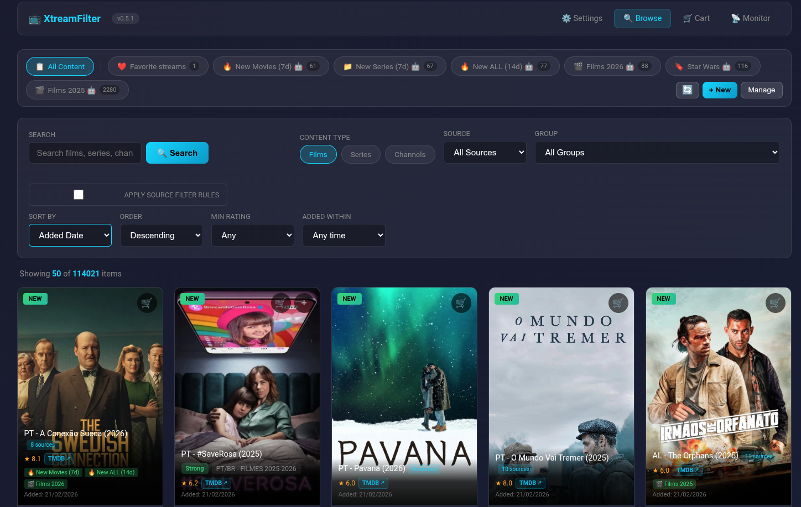
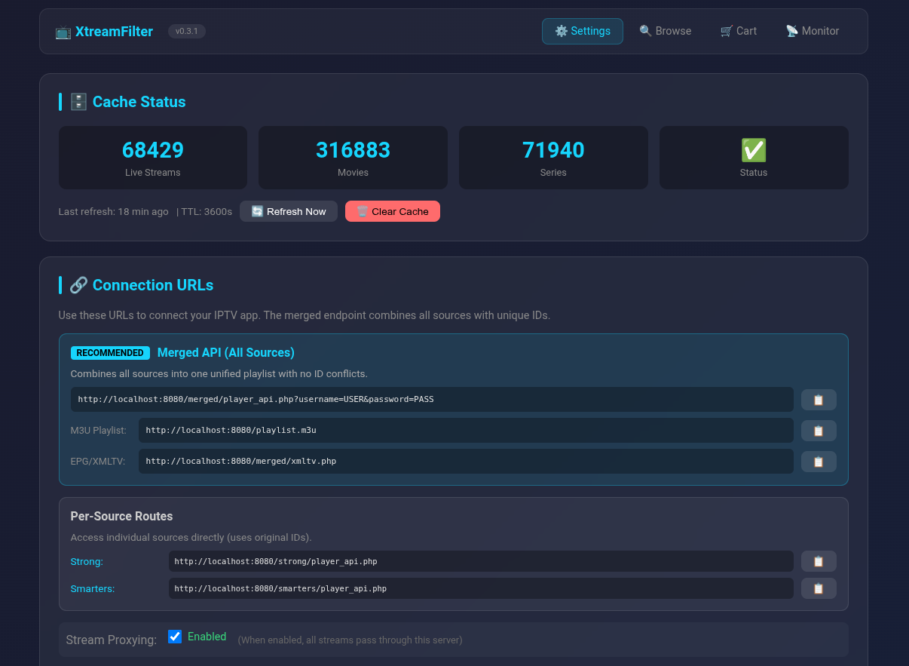
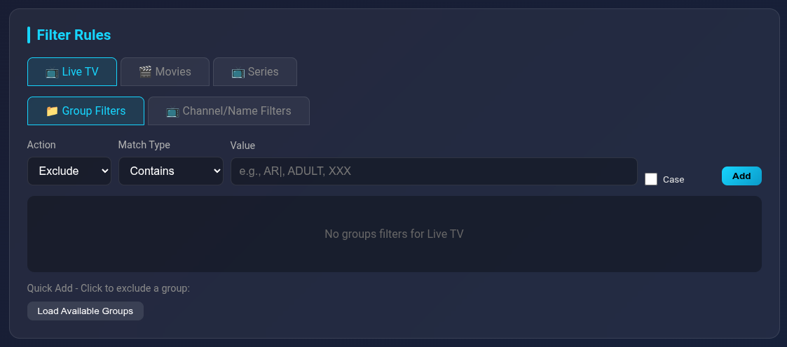

# XtreamFilter

[](https://hub.docker.com/r/spanishst/xtreamfilter)
[](https://hub.docker.com/r/spanishst/xtreamfilter)

XtreamFilter is a Docker-first Xtream Codes proxy and media workflow tool for IPTV libraries. It lets you combine multiple providers, apply per-source filters, expose merged or dedicated Xtream endpoints, browse the resulting catalog in a web UI, organize content with custom categories, monitor series and movies, and download VOD or episodes to local storage.

## Screenshots







## Features

- Full Xtream Codes proxy for merged and per-source playback
- Multi-source support with dedicated routes per provider
- Merged playlists and virtual IDs to avoid source collisions
- Optional stream proxy mode to hide upstream URLs from clients
- Per-source filters for live, VOD, and series groups/channels
- Web UI for source management, browsing, downloads, categories, and monitoring
- Rich Browse page with search, groups, source filters, sorting, ratings, and preview playback
- Manual and automatic custom categories with pattern matching, recent-content filters, and Telegram notifications
- Download cart for movies and series episodes with progress tracking and retry tools
- Jellyfin/Kodi-friendly output with `.nfo` files and poster artwork
- Series monitoring for new episodes, scoped seasons, full-series capture, and backfill
- Movie monitoring by title or TMDB ID with per-source and per-category restrictions
- Download scheduling, throttling, player-profile emulation, and Telegram download notifications
- Version check endpoint and in-app update awareness

## Quick Start

### Docker Hub

```bash
docker run -d \
  --name xtreamfilter \
  -p 8080:5000 \
  -v ./data:/data \
  -v ./downloads:/data/downloads \
  --restart unless-stopped \
  -e TZ=Europe/Paris \
  spanishst/xtreamfilter:latest
```

### docker compose

```yaml
services:
  xtreamfilter:
    image: spanishst/xtreamfilter:latest
    container_name: xtreamfilter
    ports:
      - "8080:5000"
    volumes:
      - ./data:/data
      - ./downloads:/data/downloads
    restart: unless-stopped
    environment:
      - TZ=Europe/Paris
```

Start it with:

```bash
docker compose up -d
```

### Build From Source

```bash
git clone https://github.com/SpanishST/xtreamfilter.git
cd xtreamfilter
docker compose up --build -d
```

### First Steps

1. Open `http://localhost:8080`
2. Add one or more Xtream sources
3. Configure the dedicated route for each source
4. Adjust filters for live, VOD, and series as needed
5. Refresh the cache
6. Use the displayed Xtream or M3U URLs in your IPTV client

## Core Concepts

### Source Model

Each provider is configured as a separate source with:

- Name
- Host
- Username and password
- Dedicated route
- Optional group prefix
- Maximum connections
- Per-source filters

Dedicated routes are important because upstream providers can reuse the same IDs for streams, VOD items, or series.

### Merged vs Dedicated Access

XtreamFilter exposes content in two ways:

- Merged access: all enabled sources appear under one virtualized endpoint
- Dedicated access: each source keeps its own Xtream-compatible endpoint

### Data Storage

Runtime data is stored under `/data`, including:

- `config.json` for source and option settings
- `app.db` for cache indexes, categories, monitoring state, and related persisted data
- cache and download metadata used by the UI and background jobs

## Connection URLs

### Merged Xtream Endpoint

Recommended when you want one combined playlist across all enabled sources.

```text
Server: http://YOUR_SERVER_IP:8080/merged
Username: proxy
Password: proxy
```

### Per-Source Xtream Endpoints

Filtered endpoint:

```text
Server: http://YOUR_SERVER_IP:8080/<route>
Username: <provider username>
Password: <provider password>
```

Unfiltered endpoint:

```text
Server: http://YOUR_SERVER_IP:8080/<route>/full
Username: <provider username>
Password: <provider password>
```

### M3U Playlists

| URL | Description |
| --- | --- |
| `/playlist.m3u` | Merged playlist using virtual IDs |
| `/<route>/playlist.m3u` | Filtered playlist for one source |
| `/<route>/full/playlist.m3u` | Unfiltered playlist for one source |

## Stream Proxy Mode

When proxy mode is enabled, clients stream through XtreamFilter instead of receiving upstream redirect URLs directly.

### Why use it

- Hide upstream server URLs from clients
- Centralize stream access through one server
- Improve playback stability on problematic sources
- Keep client configuration simple when upstream URLs change

### Toggle Proxy Mode

```bash
curl http://localhost:8080/api/options/proxy

curl -X POST http://localhost:8080/api/options/proxy \
  -H "Content-Type: application/json" \
  -d '{"enabled": true}'
```

## Filtering

Filters are configured per source and per content type.

### Content Types

- `live`
- `vod`
- `series`

### Filter Targets

- `groups`
- `channels`

### Match Modes

| Mode | Description |
| --- | --- |
| `contains` | Value appears anywhere |
| `not_contains` | Value must not appear |
| `starts_with` | Name begins with value |
| `ends_with` | Name ends with value |
| `exact` | Exact match |
| `regex` | Regular expression |
| `all` | Match everything |

### Typical Patterns

- Exclude all, then whitelist selected content
- Keep only specific streaming-service groups
- Exclude adult content globally
- Apply separate rules for live vs VOD vs series

## Cache System

The application builds and refreshes a local cache of upstream categories and content.

- Default cache TTL: `3600` seconds
- Refresh runs in the background
- Progress is visible in the UI
- Cache survives restarts
- Automatic categories refresh after cache refresh

### Cache UI shows

- Last refresh time
- Next refresh estimate
- Cache validity
- Per-source item counts
- Refresh progress and current step

## Browse UI

The Browse page is available at `/browse`.

### What it supports

- Search by title
- TMDB-prefixed search such as `tmdb:12345`
- Filter by content type, source, group, and custom category
- Rating and recency filters for VOD and series
- Sorting for catalog exploration
- Group dropdown populated dynamically from the current source/type selection
- Built-in playback preview for live, VOD, and playable episodes
- Add-to-cart and add-to-category actions directly from the result cards
- Browse-from-monitor links for both series and movies

### Stream Preview

The built-in player supports:

- MPEG-TS and HLS playback
- Audio track switching when available
- Keyboard shortcuts
- Episode playback from the series browser

## Custom Categories

Custom categories help you organize content across all sources.

### Manual Categories

Manual categories are curated item by item.

Typical flow:

1. Create a category in manual mode
2. Select accepted content types
3. Browse the catalog and use the `+` button to link items
4. Use the same control again to unlink them later

### Automatic Categories

Automatic categories are built from pattern rules.

You can configure:

- Category name and icon
- Accepted content types
- Pattern list
- Pattern logic: `and` or `or`
- Recently-added window
- Whether source filters should also apply
- Telegram notification per category

Automatic categories refresh when cache refresh runs, and can also be refreshed manually.

### Category Use Cases

- New movies from the last 7 days
- 4K content
- Provider-specific highlights
- Hand-picked favorites
- Monitoring-only custom channels used to restrict movie or series checks

## Telegram Notifications

Telegram is used for:

- automatic category notifications
- monitoring notifications
- optional download notifications

### Setup

1. Create a bot with [@BotFather](https://t.me/BotFather)
2. Get your chat ID
3. Configure token and chat ID in the UI or API
4. Send a test notification

### Telegram API

| Endpoint | Method | Description |
| --- | --- | --- |
| `/api/config/telegram` | `GET` | Get Telegram settings with masked token |
| `/api/config/telegram` | `POST` | Update Telegram settings |
| `/api/config/telegram/test` | `POST` | Send a basic test notification |
| `/api/config/telegram/test-diff` | `POST` | Send a sample category-style notification |

## Download Manager

The download workflow is exposed through the Browse page and the Cart page.

### Supported Downloads

- Single VOD movie
- Single series episode
- Full season
- Entire series

### Queue Behavior

Downloads are persisted and processed sequentially.

Item states include:

- `queued`
- `downloading`
- `completed`
- `failed`
- `cancelled`
- `move_failed`

### Download Features

- Retry failed or cancelled items
- Retry all failed items
- Resume move step when the temp-to-final move failed
- Track current speed, ETA-related speed, and pause state
- Optional Telegram notifications when queueing or completing downloads
- Duplicate prevention for active queued/downloading entries
- Crash recovery for interrupted download state

### Throttling And Scheduling

Download options are configurable from the UI and API:

- Bandwidth limit
- Periodic pause interval and pause duration
- Player-profile emulation
- Burst reconnect behavior
- Per-day download schedule windows

If a download schedule is enabled, automatic monitoring downloads wait until the configured window is open.

### Output Layout

Downloads are organized into media-library-friendly folders and include metadata.

Example layout:

```text
<download_path>/
├── Films/
│   └── Movie Name/
│       ├── Movie Name.mp4
│       ├── Movie Name.nfo
│       └── poster.jpg
└── Series/
    └── Show Name/
        ├── tvshow.nfo
        ├── poster.jpg
        ├── S01/
        │   ├── Show Name S01E01 - Episode Title.mkv
        │   └── Show Name S01E01 - Episode Title.nfo
        └── S02/
            └── Show Name S02E01 - Episode Title.mp4
```

### Download APIs

| Endpoint | Method | Description |
| --- | --- | --- |
| `/api/cart` | `GET` | List cart items |
| `/api/cart` | `POST` | Add movie, episode, season, or full-series items |
| `/api/cart/{item_id}` | `DELETE` | Remove one item |
| `/api/cart/{item_id}/retry` | `POST` | Retry a failed, cancelled, or move-failed item |
| `/api/cart/{item_id}/move` | `POST` | Retry only the final move step for a `move_failed` item |
| `/api/cart/retry-all` | `POST` | Retry all failed/cancelled/move-failed items |
| `/api/cart/clear` | `POST` | Clear items by mode |
| `/api/cart/start` | `POST` | Start the worker manually |
| `/api/cart/cancel` | `POST` | Request cancellation of the active download |
| `/api/cart/status` | `GET` | Queue and active-download status |
| `/api/cart/active-source-downloads` | `GET` | Count active downloads by source |
| `/api/cart/series-episodes/{source_id}/{series_id}` | `GET` | Fetch season/episode structure for a series |

### Download Options APIs

| Endpoint | Method | Description |
| --- | --- | --- |
| `/api/options/download_path` | `GET`, `POST` | Get or set the final download directory |
| `/api/options/download_temp_path` | `GET`, `POST` | Get or set the temp directory |
| `/api/options/test_path` | `POST` | Validate write access to a path |
| `/api/options/download_throttle` | `GET`, `POST` | Get or set throttling, pause, and profile options |
| `/api/options/player_profiles` | `GET` | List supported player profiles |
| `/api/options/download_notifications` | `GET`, `POST` | Get or set Telegram download notification options |
| `/api/options/download_schedule` | `GET`, `POST` | Get or set the day-by-day download schedule |

## Monitoring

The Monitor page is available at `/monitor` and includes separate tabs for series and movies.

### Series Monitoring

Series monitoring is designed for new-episode detection and optional download automation.

#### Series modes

- `new_only`: snapshot the current set as known and only react to future episodes
- `season`: watch one season only
- `all`: treat all discovered episodes as candidates

#### Series actions

- `download`
- `notify`
- `both`

#### Series features

- Multi-source matching
- Optional restriction to selected sources
- Optional restriction to custom categories used as monitoring channels
- Episode preview grouped by season
- Enable or disable without deleting the monitor entry
- Backfill support when editing an existing monitor entry

Backfill can queue:

- all known episodes
- all known episodes from one season
- no backfill

### Movie Monitoring

Movie monitoring watches for a VOD title to become available.

#### How movie monitoring works

1. Add a movie from the Monitor page
2. Search by title or `tmdb:<id>`
3. Optionally rename the local canonical title used for downloads
4. Restrict the search to selected sources
5. Optionally restrict those sources to selected VOD categories
6. Optionally restrict matching further through custom categories
7. Choose whether the result should notify, download, or do both

When a matching movie is found, it is marked as found or downloaded depending on the configured action and whether it was queued or already present on disk.

### Monitoring Triggering

Monitoring checks run:

- after cache refresh in the background loop
- when manually triggered through `/api/monitor/check`

### Monitoring APIs

| Endpoint | Method | Description |
| --- | --- | --- |
| `/api/monitor` | `GET` | List monitored series |
| `/api/monitor` | `POST` | Add a monitored series |
| `/api/monitor/{id}` | `PUT` | Update a monitored series |
| `/api/monitor/{id}` | `DELETE` | Delete a monitored series |
| `/api/monitor/{id}/episodes` | `GET` | Preview detected episodes and their status |
| `/api/monitor/series-meta/{source_id}/{series_id}` | `GET` | Fetch series metadata used by the UI |
| `/api/monitor/check` | `POST` | Trigger a manual monitoring run |
| `/api/monitor/movies` | `GET` | List monitored movies |
| `/api/monitor/movies` | `POST` | Add a monitored movie |
| `/api/monitor/movies/{movie_id}` | `PUT` | Update a monitored movie |
| `/api/monitor/movies/{movie_id}` | `DELETE` | Delete a monitored movie |
| `/api/monitor/movie-lookup` | `GET` | Search the VOD cache by title or TMDB ID for movie setup |
| `/api/monitor/custom-categories` | `GET` | List custom categories usable as monitoring channels |
| `/api/monitor/vod-categories` | `GET` | List VOD categories grouped by enabled source |

## Public Routes And APIs

### Xtream And Playlist Routes

| Route | Description |
| --- | --- |
| `/merged/player_api.php` | Merged Xtream API for all enabled sources |
| `/merged/live/{username}/{password}/{stream_id}` | Merged live stream route |
| `/merged/movie/{username}/{password}/{stream_id}` | Merged movie stream route |
| `/merged/series/{username}/{password}/{stream_id}` | Merged series stream route |
| `/player_api.php` | Root Xtream API helper route |
| `/full/player_api.php` | Root unfiltered Xtream helper route |
| `/{source_route}/player_api.php` | Filtered Xtream API for one dedicated source |
| `/{source_route}/full/player_api.php` | Unfiltered Xtream API for one dedicated source |
| `/{source_route}/playlist.m3u` | Filtered M3U playlist for one source |
| `/playlist.m3u` | Merged M3U playlist |
| `/merged/xmltv.php` | Merged XMLTV/EPG output |

### Web UI Routes

| Route | Description |
| --- | --- |
| `/` | Main configuration UI |
| `/browse` | Catalog browser |
| `/cart` | Download cart and queue UI |
| `/monitor` | Series and movie monitoring UI |

### Health And Version

| Route | Method | Description |
| --- | --- | --- |
| `/health` | `GET` | Liveness check |
| `/api/version` | `GET` | Current version, latest release, and update availability |

### Source Management

| Endpoint | Method | Description |
| --- | --- | --- |
| `/api/sources` | `GET` | List sources |
| `/api/sources` | `POST` | Create a source |
| `/api/sources/{source_id}` | `GET` | Get one source |
| `/api/sources/{source_id}` | `PUT` | Update one source |
| `/api/sources/{source_id}` | `DELETE` | Delete one source |
| `/api/sources/{source_id}/filters` | `GET` | Get source filters |
| `/api/sources/{source_id}/filters` | `POST` | Replace source filters |
| `/api/sources/{source_id}/filters/add` | `POST` | Add one filter rule |
| `/api/sources/{source_id}/filters/delete` | `POST` | Delete one filter rule |

### Cache Management

| Endpoint | Method | Description |
| --- | --- | --- |
| `/api/cache/status` | `GET` | Cache status and counts |
| `/api/cache/refresh` | `POST` | Trigger a background refresh |
| `/api/cache/cancel-refresh` | `POST` | Clear refresh state |
| `/api/cache/clear` | `POST` | Clear the cached data |

### Browse APIs

| Endpoint | Method | Description |
| --- | --- | --- |
| `/groups` | `GET` | Lightweight group list for a content type and source |
| `/channels` | `GET` | Lightweight channel/item list |
| `/api/browse` | `GET` | Main browse/search endpoint |
| `/api/browse/groups` | `GET` | Group list with counts for current source/type |

### Categories APIs

| Endpoint | Method | Description |
| --- | --- | --- |
| `/api/categories` | `GET` | List categories with full data |
| `/api/categories` | `POST` | Create a category |
| `/api/categories/summary` | `GET` | Lightweight category list for nav and quick state |
| `/api/categories/{category_id}` | `GET` | Get one category |
| `/api/categories/{category_id}` | `PUT` | Update one category |
| `/api/categories/{category_id}` | `DELETE` | Delete one category |
| `/api/categories/{category_id}/items` | `POST` | Add an item to a manual category |
| `/api/categories/{category_id}/items/{content_type}/{source_id}/{item_id}` | `DELETE` | Remove an item from a manual category |
| `/api/categories/refresh` | `POST` | Refresh automatic categories |

### General Options APIs

| Endpoint | Method | Description |
| --- | --- | --- |
| `/api/options` | `GET`, `POST` | Get or update the options object |
| `/api/options/proxy` | `GET`, `POST` | Get or set proxy mode |
| `/api/options/refresh_interval` | `GET`, `POST` | Get or set background refresh interval |

## Configuration Overview

Configuration is primarily stored in `/data/config.json`.

Important areas:

- `sources`: provider definitions and per-source filters
- `content_types`: global enablement of live, VOD, and series
- `options.proxy_streams`: stream proxy toggle
- `options.telegram`: Telegram credentials and enablement
- `options.download_path` and `options.download_temp_path`: file-system destinations
- `options.download_*`: throttling, pause, profile, notifications, and scheduling

Example shape:

```json
{
  "sources": [
    {
      "id": "abc12345",
      "name": "Provider A",
      "host": "http://provider.example.com",
      "username": "user",
      "password": "pass",
      "enabled": true,
      "prefix": "[A] ",
      "route": "providera",
      "max_connections": 1,
      "filters": {
        "live": { "groups": [], "channels": [] },
        "vod": { "groups": [], "channels": [] },
        "series": { "groups": [], "channels": [] }
      }
    }
  ],
  "content_types": {
    "live": true,
    "vod": true,
    "series": true
  },
  "options": {
    "proxy_streams": true,
    "refresh_interval": 3600,
    "telegram": {
      "enabled": false,
      "bot_token": "",
      "chat_id": ""
    },
    "download_path": "/data/downloads",
    "download_temp_path": "/data/downloads/.tmp"
  }
}
```

## Development

Run locally without Docker:

```bash
pip install fastapi uvicorn[standard] httpx jinja2 python-multipart lxml rapidfuzz packaging aiosqlite
uvicorn app.main:app --host 0.0.0.0 --port 5000 --reload
```

The application will then be available at `http://localhost:5000`.

## Running Tests

```bash
uv run pytest tests/ -v
```
