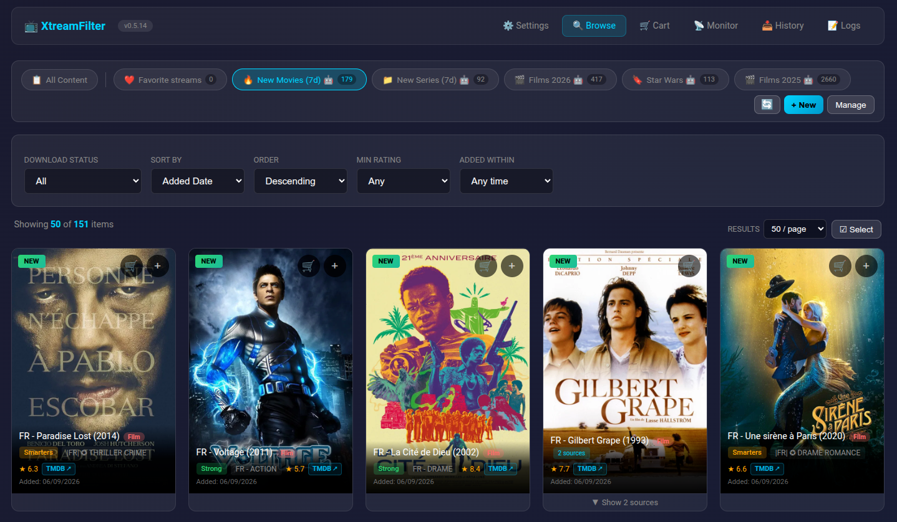
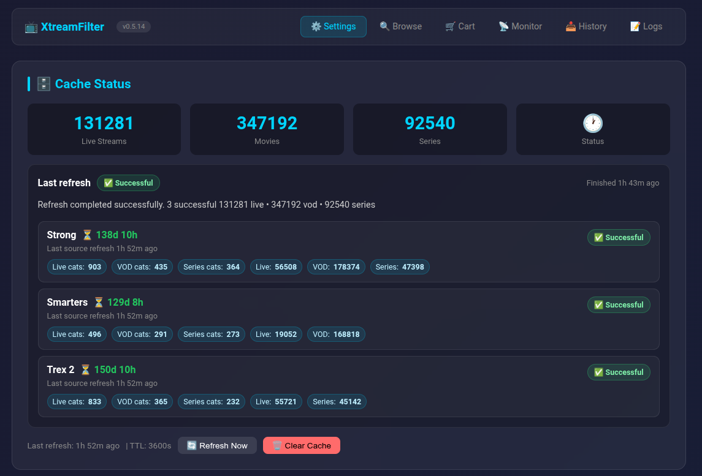
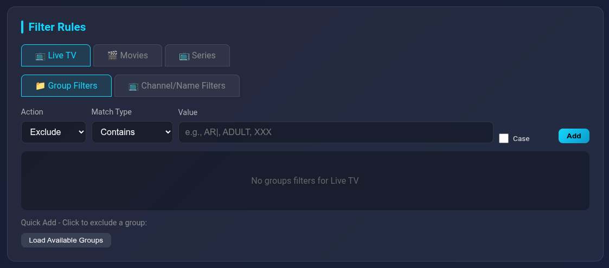

# XtreamFilter

[](https://hub.docker.com/r/spanishst/xtreamfilter)
[](https://hub.docker.com/r/spanishst/xtreamfilter)

XtreamFilter is a Docker-first Xtream Codes proxy and media workflow tool for IPTV libraries. Combine multiple providers, apply per-source filters, browse the merged catalog, organize content, monitor movies and series, and download VOD or episodes to local storage.

## Screenshots







## Features

- Merged and per-source Xtream Codes endpoints and M3U playlists
- Optional stream proxy mode and per-source content filters
- Web UI for catalog browsing, custom categories, downloads, and monitoring
- Telegram notifications, Jellyfin library refreshes, and configurable webhooks
- Media-library-friendly downloads with `.nfo` metadata and poster artwork

## Quick Start

```yaml
services:
  xtreamfilter:
    image: spanishst/xtreamfilter:latest
    container_name: xtreamfilter
    ports:
      - "8080:5000"
    volumes:
      - ./data:/data
      - ./downloads:/downloads
    restart: unless-stopped
    environment:
      - TZ=Europe/Paris
      - PUID=1000
      - PGID=1000
```

Start the application with `docker compose up -d`, then open `http://localhost:8080`, add one or more Xtream sources, and refresh the cache.

To build from source, clone the repository and run `docker compose up --build -d`.

## Documentation

- [Documentation index](doc/README.md)
- [Installation and permissions](doc/installation.md)
- [Configuration, sources, and playlists](doc/configuration.md)
- [Catalog, categories, and filtering](doc/catalog.md)
- [Downloads and monitoring](doc/downloads-and-monitoring.md)
- [Notifications and integrations](doc/integrations.md)
- [Routes and API reference](doc/api-reference.md)

## Development

For local development and tests, see [Installation and permissions](doc/installation.md#development-and-tests).
